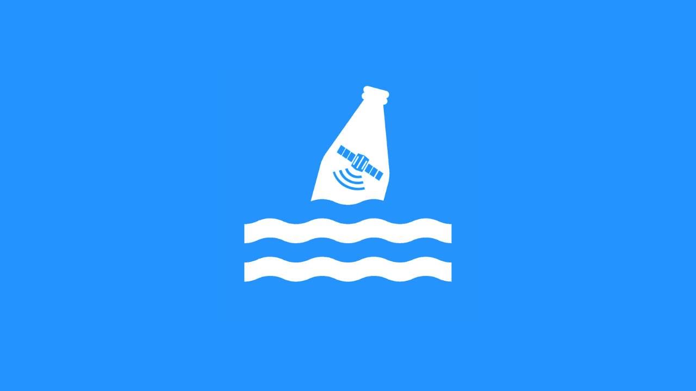

<h1 align="center">Scripts in Bottles</h1>
<p align="center">
  
  <a href="https://github.com/camoredo/spaceapps/blob/master/README.md" target="_blank">
    
  </a>
  <a href="https://github.com/camoredo/spaceapps/graphs/commit-activity" target="_blank">
    
  </a>
  <a href="https://github.com/camoredo/spaceapps/blob/master/LICENSE" target="_blank">
    
  </a>
</p>

> Scripts in Bottles is a supplementary repository to the main [Messages in Bottles](https://github.com/camoredo/spaceapps) webapp. It currently contains a script that transforms the suspected plastic patches dataset, in SNAP format, into a simple JSON that the webapp can use. The repository also contains relevant documentation about the process of gathering and transforming the data from Sentinel-2.

<p align="center">
  <a href="https://www.youtube.com/watch?v=qdJYkoqPBbQ&ab_channel=LuigidelRosario" target="_blank">
    
  </a>
</p>

## 🔬 Data Methodology
All data is taken from the [Copernicus Open Access Hub](https://scihub.copernicus.eu/), and processed using [Acolite](https://github.com/acolite/acolite) and [SNAP Sentinel Toolkits](http://step.esa.int/main/download/snap-download/). 

### 1. Downloading Data
To download satellite images, visit the [Copernicus Open Access Hub](https://scihub.copernicus.eu/) and register for an account. Selected areas of interest are based on [(Biermann, et. al., 2020)](https://www.nature.com/articles/s41598-020-62298-z), as well as some other areas discussed by the group.

The satellite product used is **Sentinel-2 MSI L-1C.** Made sure that the images selected have _minimal cloud coverage_.

### 2. Preprocessing
Once the data has been downloaded, the following preprocessing steps need to be executed:
1. **Atmospheric Correction** (using [Acolite](https://github.com/acolite/acolite))
2. **Land/Sea Masking** (using the [SNAP Sentinel Toolkits](http://step.esa.int/main/download/snap-download/))

### 3. NDVI/FDI Calculation
The equations for NDVI and FDI were derived form [(Biermann et. al., 2020)](https://www.nature.com/articles/s41598-020-62298-z) and [(Topouzelis et. al., 2020)](https://www.mdpi.com/2072-4292/12/12/2013/htm). Use the **Band Math** tool to plug in the following expressions.
#### NDVI:
```
(rhos_833 - rhos_665) / (rhos_833 + rhos_665)
```
#### FDI:
```
rhos_833 - (rhos_739 + ((rhos_1610 - rhos_739) * ((833-665)/(1610-665))*10))
```
After getting both indices, use a **mask** to get pixels of suspected plastics. The threshold values were derived from [(Biermann et. al., 2020)](https://www.nature.com/articles/s41598-020-62298-z):

```
ndvi > 0.02 and ndvi < 0.24 and fdi > 0.018 and fdi < 0.067
```
### 4. Exporting Pixel Data
Once the mask has been applied, export the pixel data into a `.txt` file (_Raster > Export > Mask Pixels_). This will be used by the Python script in this repository. Make sure you place them in the `inputs` folder in this directory for the script to work.

### 5. Convert to JSON files
After retrieving the `.txt` file from the SNAP Sentinel Toolkit, import the contents into a `pandas` dataframe and re-export it as JSON files: one to represent the scatter plot and another to represent a heatmap. The scatter plot representation is the latitude and longitude pixel values from the mask. The heatmap representation, on the other hand, is the same representation, but neighboring pixel values are aggregated to create the heatmap values.

You can achieve this final step by running the script in this repository. Proceed to the [Get Started](#-get-started) section to know more about how to run it.

## 🛠 Built With

- [Python 3](https://www.python.org/) - Main Language
- [Pandas](https://pandas.pydata.org/) - Data Transformation

## 🤝 Contributing

Contributions, issues, and feature requests are welcome!<br />

Feel free to check the [issues page](https://github.com/camoredo/spaceapps/issues) for any open issues. If this is your first time contributing to Open Source, check out the [Contributing Guidelines](https://github.com/camoredo/spaceapps/blob/master/CONTRIBUTING.md).

You can also suggest a new feature by [creating an issue](https://github.com/camoredo/spaceapps/issues/new). Please wait for confirmation before working on it.

### Good for First Timers

- [ ] Add unit tests, integration tests, and end-to-end tests.
- [ ] Fix script hacks and technical debts.
- [ ] Create a plan to host the map data points.

## 🚀 Get Started

Below is a guide on the common commands you might use all throughout the development process. In the project directory, you can run:

#### `virtualenv -p python3 venv`

Creates a Python 3 virtual environment. Make sure you have [Python 3](https://yarnpkg.com/) and [Virtualenv](https://virtualenv.pypa.io/en/latest/) installed and configured first.

#### `source venv/bin/activate`

Activates the virtual environment. Make sure you are in the root directory of this repository first. You can also run `deactivate` to deactivate the virtual environment.

#### `pip install -r requirements.txt`

Installs all package dependencies of the script. Make sure you are in the root directory of this repository first.

#### `python main.py`

Executes the script. The output will be placed in the `outputs` folder in this directory. Make sure you are in the root directory of this repository first.

## 📝 License

Copyright © 2020 [The Manila Bay Sands Team](https://github.com/camoredo/spaceapps/blob/main/AUTHORS).<br />
This project is [MIT](https://github.com/camoredo/spaceapps/blob/master/LICENSE) licensed.


***
_This README was generated with ❤️ by [readme-md-generator](https://github.com/kefranabg/readme-md-generator)_
